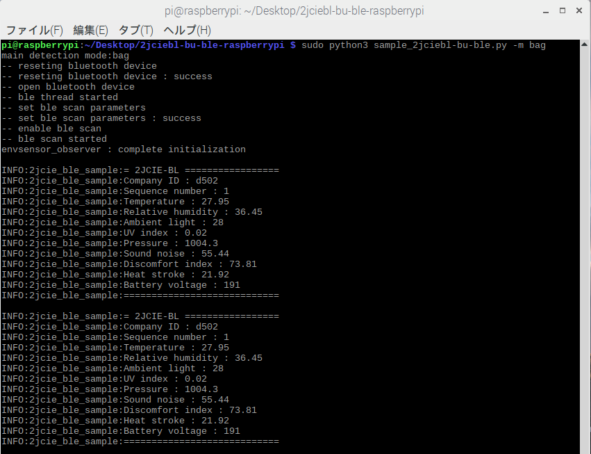

# 2jciebl-bu-ble-raspberrypi
This is a sample program to acquire sensing data from the Omron environmental sensors 2JCIE-BL and 2JCIE-BU via the BLE interface.  
Each sensor can acquire the following values respectively.  

- [2JCIE-BL Environment Sensor](https://www.components.omron.com/product-detail?partId=73064)  
  
    - Temperature
    - Relative humidity
    - Ambient light
    - UV index
    - Pressure
    - Sound noise
    - Discomfort index
    - Heat stroke

- [2JCIE-BU Environment Sensor (USB Type)](https://www.components.omron.com/product-detail?partId=73065)   
  
    - Temperature
    - Relative humidity
    - Ambient light
    - Barometric pressure
    - Sound noise
    - 3-Axis acceleration
    - VOC Detection
    - Discomfort index
    - Heat stroke
    - Seismic Detection

## language
- [English](./README.md)
- [Japanase](./README_ja.md)

## Description
- sample_2jciebl-bu-ble.py  
This sample program that scans the advertising packet emitted by the environmental sensor with Bluetooth Low Energy and outputs the included sensing data to the log file.  
Specify the environmental sensor type of data acquisition target with the option at startup.  
Note: [Pre-setting](#link2) is necessary when using 2JCIE-BL01 Environment Sensor.

    - 2JCIE-BL Environment Sensor  
    The following values are output.
        - Company ID
        - Temperature
        - Relative humidity
        - Ambient light
        - UV Index
        - Barometric pressure
        - Sound Noise
        - eTVOC
        - eCO2
    
    - 2JCIE-BU Environment Sensor (USB Type)
        - Company ID
        - Sequence Number
        - Temperature
        - Relative humidity
        - Ambient light
        - UV Index
        - Pressure
        - Sound Noise
        - Discomfort Index
        - Heat stroke
        - Battery Voltage

***DEMO:***  
By running sample_2jciebl-bu-ble.py you can check the sensing data on the console.  
A log file called sample.log is created and data is output.




## Installation
1. It is necessary to install dependency software beforehand.  
    [Dependencies](#link1)
2. Open Terminal and execute the following command.    
    ```
    $ mkdir omron_sensor
    $ git clone https://github.com/omron-devhub/2jciebl-bu-ble-raspberrypi.git
    ```

## Usage
This is a procedure to operate the sample program.  
Note: When using 2JCIE-BL Environment Sensor, [Pre-set](#link2) is required.

- 2JCIE-BL Environment Sensor
Open Terminal and execute the following command.  
    ```
    $ sudo python3 sample_2jciebl-bu-ble.py -m bag
    ```
    Stop wiht Ctrl + C.

- 2JCIE-BU Environment Sensor (USB Type)
Open Terminal and execute the following command.  
    ```
    $ sudo python3 sample_2jciebl-bu-ble.py -m usb
    ```
    Stop wiht Ctrl + C.

## <a name="link"></a>Dependencies
2jciebl-bu-ble-raspberrypi requires the following dependencies.
- [python3](https://www.python.org/)
- [pybluez](https://code.google.com/archive/p/pybluez/wikis/Documentation.wiki)

## Contributors
Thank you to all our [contributors](https://github.com/omron-devhub/2jciebl-bu-ble-raspberrypi/graphs/contributors)!

---

## <a name="link2">2JCIE-BL Environment Sensor Pre Settings</a>

### Advance preparation
Download the BLE device utility application "BLE Scanner" to your smartphone.
- [android](https://play.google.com/store/apps/details?id=com.macdom.ble.blescanner&hl=ja)
- [iOS](https://itunes.apple.com/jp/app/ble-scanner-4-0/id1221763603)

### Change Beacon Mode
Change the beacon mode of the environment sensor by the following procedure.
1. Find and connect a BLE device named Env (EnvSensor - BL01)
1. Open "0C4C**3040**-7700-46F4-AA96D5E974E32A54" of CUSTOM SERVICE
1. Open "0C4C**3042**-7700-46F4-AA96D5E974E32A54" of CUSTOM CHERACTERISTIC
1. Tap Write Value "0808A000000A0032**04**00"
1. Tap Read Value to see if the set value is reflected
1. Turn off the connection and confirm that the name of the device has changed to **EP- BL01**.

### Chamge Measurement Interval
Change the measurement interval of the environment sensor by the following procedure.
1. Open 0C4C**3010**-7700-46F4-AA96D5E974E32A54 of CUSTOM SERVICE
1. Open 0C4C**3011**-7700-46F4-AA96D5E974E32A54 of CUSTOM CHERACTERISTIC
1. Tap Write Value an arbitrary value in the range of 1 to 3600 sec.  
Example: If 60 seconds, write "3C"
1. Tap Read Value to see if the set value is reflected